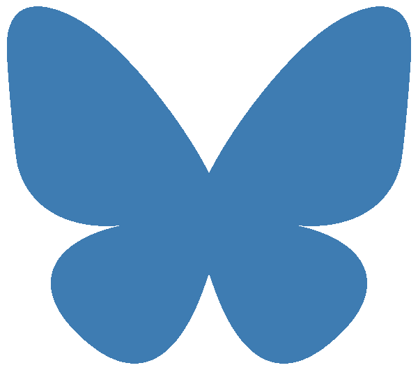

  
  

    <h1 class="name">Matilde Ellen Simonetti, M.Sc.</h1>
    
PhD Candidate · Institute of Psychology · Cognitive and Experimental Psychology · RWTH Aachen

  

## About

I am a PhD student working under the supervision of 
<a href="https://www.psych.rwth-aachen.de/cms/psy/das-institut/kognitions-und-experimentalpsychologie/team/~cjoix/tanja-roembke/?allou=1&lidx=1" target="_blank">Tanja Roembke</a> 
and 
<a href="https://www.psych.rwth-aachen.de/cms/psy/Das-Institut/Kognitions-und-Experimentalpsychologie/Team/~ikpk/Iring-Koch/lidx/1/" target="_blank">Iring Koch</a>.  

My research focuses on how people learn words, particularly in bilingual contexts, 
sometimes using eye-tracking to uncover real-time learning processes.  

I am also a member of the 
<a href="https://sites.google.com/view/gewonn/home" target="_blank">GeWonn network</a> and of
<a href="https://www.womenincogsci.org/wics-europe" target="_blank">WiSC E+ Leadership Team</a>.

---

### More

🔗 See the **[Publications](publications)** page for a list of my papers.  
🔗 See the **[Research](research)** page for the questions and directions I’m most excited about.  

---

<h2>Contact & Links</h2>

  <a href="mailto:simonetti@psych.rwth-aachen.de" aria-label="Email">
    <i class="fa-solid fa-envelope"></i>
  </a>

  <a href="https://scholar.google.com/citations?hl=it&user=JmBEc0UAAAAJ" target="_blank" aria-label="Google Scholar">
    <i class="fa-brands fa-google-scholar"></i>
  </a>

  <a href="https://www.researchgate.net/profile/Matilde-Simonetti?ev=hdr_xprf" target="_blank" aria-label="ResearchGate">
    <i class="fa-brands fa-researchgate"></i>
  </a>

  <a href="https://www.linkedin.com/in/matilde-ellen-simonetti/?skipRedirect=true" target="_blank" aria-label="LinkedIn">
    <i class="fa-brands fa-linkedin"></i>
  </a>

  

  <a href="https://github.com/matildellen" target="_blank" aria-label="GitHub">
    <i class="fa-brands fa-github"></i>
  </a>

  <a href="https://www.psych.rwth-aachen.de/cms/psy/das-institut/kognitions-und-experimentalpsychologie/team/~yjiij/matilde-simonetti/?allou=1&lidx=1" 
     target="_blank" aria-label="RWTH Profile">
    <i class="fa-solid fa-building-columns"></i>
  </a>

  <a class="cv-button" href="/files/CV_Matilde_Simonetti.pdf" target="_blank">
    Download CV
  </a>

