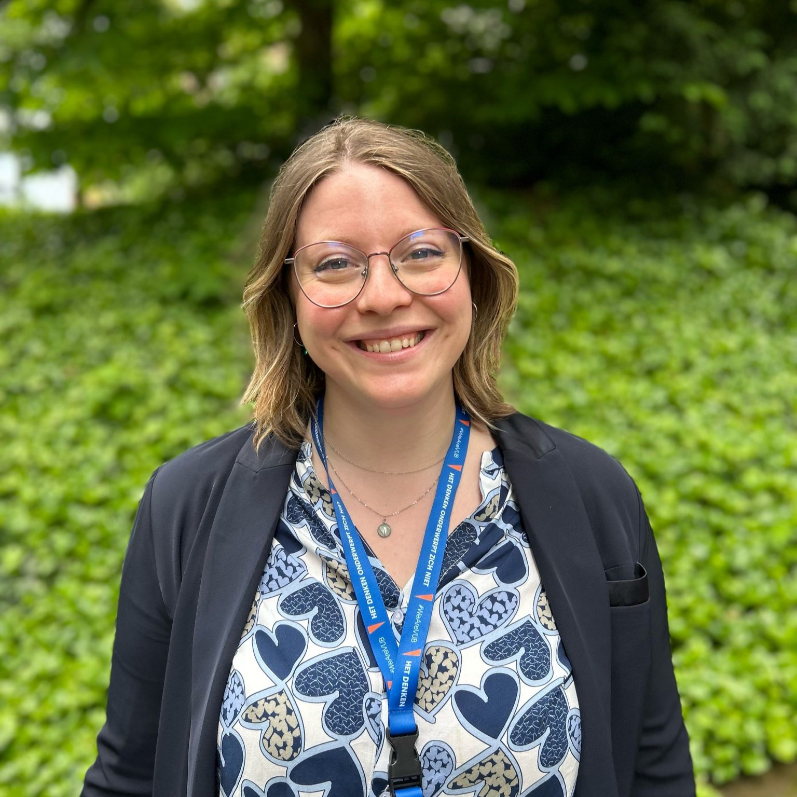

  
  

    <h1 class="name">Matilde Simonetti</h1>
    
PhD Candidate, Institute of Psychology, Cognitive and Experimental Psychology, RWTH Aachen

  

## About

Matilde is currently a PhD student working under the supervision of Tanja Roembke. 
She is interested in word learning, sometimes with the help of eye-tracking, especially in bilingual populations. 
I am part of the Gewonn network.

---

### More

🔗 See the **[Publications](publications)** page for a list of my papers.  
🔗 See the **[Research](research)** page for the questions and directions I’m most excited about.  

---

<h2>Contact & Links</h2>

📧 Email: simonetti@psych.rwth-aachen.de &nbsp; 
🎓 Google Scholar: <a href="LINK">link</a> &nbsp; 
👩🏼‍🔬 ResearchGate: <a href="LINK">link</a> &nbsp; 
🐦 LinkedIn: <a href="LINK">link</a> &nbsp; 
🔤 GeWonn: <a href="LINK">link</a> &nbsp; 
🦋 BlueSky: <a href="LINK">link</a> &nbsp; 
👾 GitHub: <a href="LINK">link</a>

